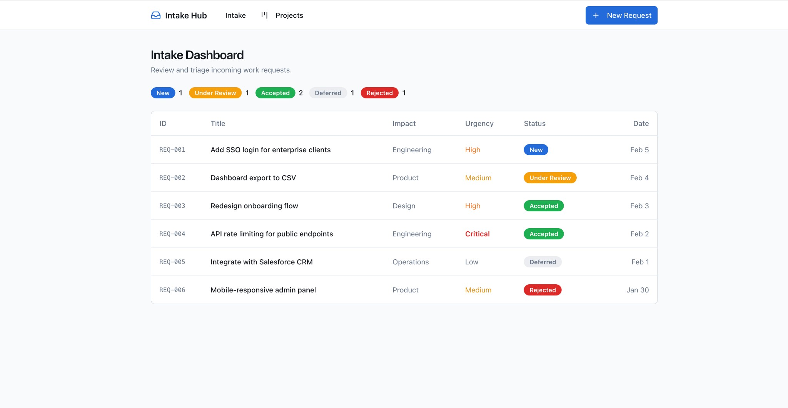
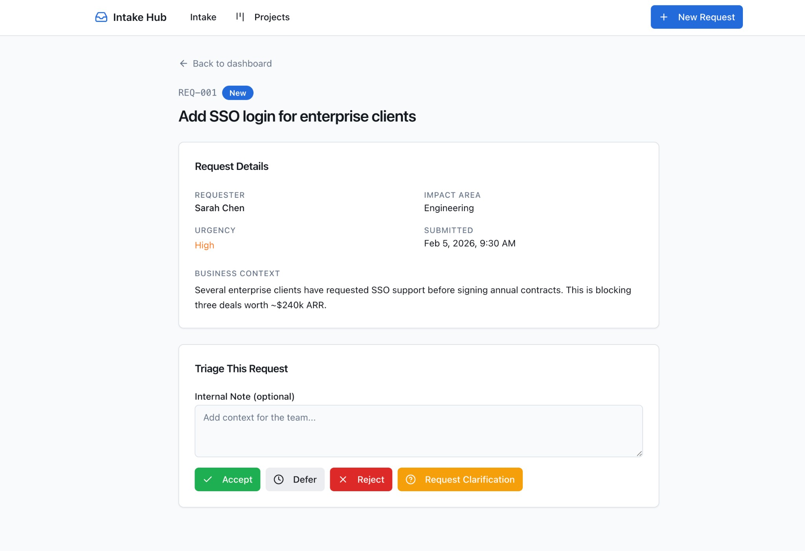
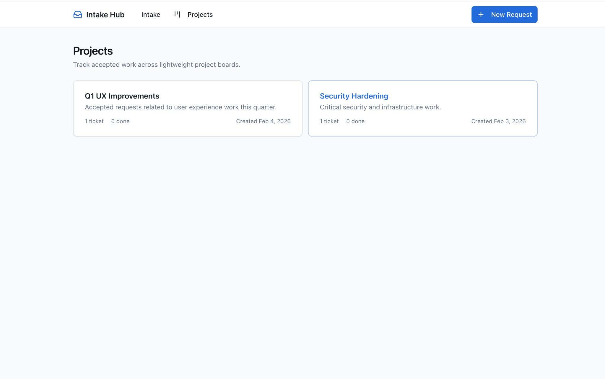
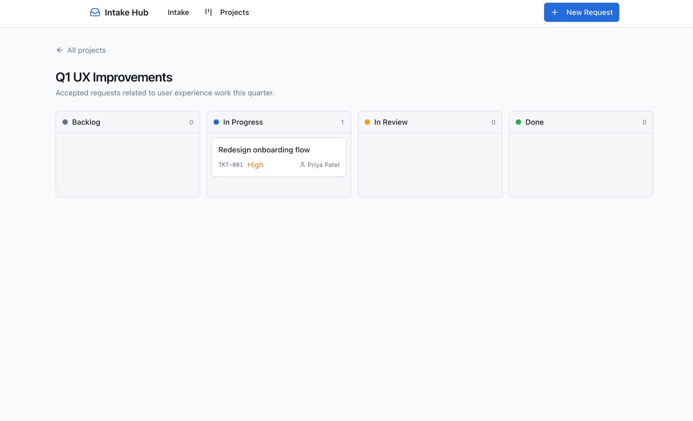
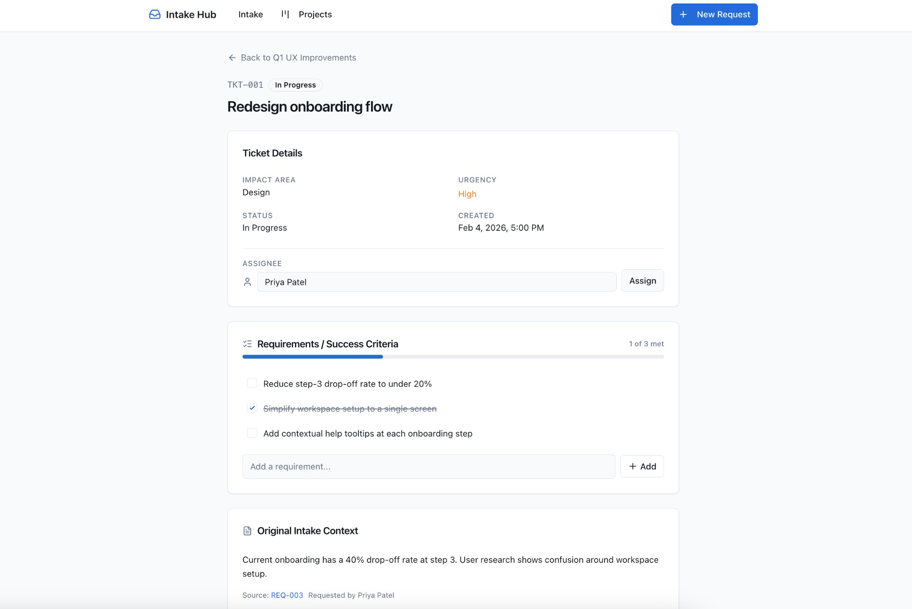

# Intake Hub

A single flow to capture stakeholder requests, triage what’s feasible, and turn accepted work into tickets on a project board—all in one place.

**Live site:** [project-intake-hub.vercel.app](https://project-intake-hub.vercel.app)

---

## Why this exists

After too many projects where stakeholders didn’t know exactly what they wanted—or what was actually feasible—I needed a clear system:

- **One place** for incoming asks, so nothing gets lost in email or Slack.
- **A real triage step** so we can accept, defer, reject, or ask for clarification before anything becomes “a project.”
- **A simple path** from “we’re doing this” to tickets on a board, without copying things into Jira/Linear/Notion by hand.

Intake Hub is that flow: **submit a request → review and triage → accept → add to a project → manage tickets on a board.** Requirements and execution live in the same app.

---

## What it does

- **Submit a request** — Stakeholders submit work with title, business context, impact area (product, engineering, operations, design, other), and urgency. No more vague “we need a thing” messages.
- **Intake dashboard** — See all requests and their status: New, Under review, Accepted, Deferred, Rejected. Quick counts and a single list to triage from.
- **Triage each request** — Open a request and accept, defer, reject, or **request clarification**. Add internal notes so the team knows why something was accepted or not. This is where “what we’re actually doing” gets decided.
- **Turn accepted work into tickets** — For accepted requests, use “Add to Project” to create a ticket on an existing project or a new one. The ticket keeps the original request’s context (title, business context, impact, urgency).
- **Project boards** — Each project has a Kanban board: **Backlog → In Progress → In Review → Done**. Drag tickets between columns. Open a ticket to see requirements, assign someone, and track progress—all linked back to the original intake request.

So: **requirements + triage + project board + tickets**, in one app, with one flow.

---

## Features

| Area | What you get |
|------|----------------|
| **Intake** | Submit form (requester, title, business context, impact area, urgency). Intake dashboard with status counts and request list. |
| **Triage** | Per-request review: Accept / Defer / Reject / Request clarification. Optional reviewer notes. |
| **Projects** | Create projects, list them with ticket counts. “Add to Project” converts an accepted request into a ticket (existing or new project). |
| **Board** | Kanban with Backlog, In Progress, In Review, Done. Drag-and-drop to move tickets. |
| **Tickets** | Ticket detail with requirements list, assignee, link back to original intake request. |

---

## Screenshots

**Intake dashboard** — Review and triage incoming requests by status (New, Under review, Accepted, Deferred, Rejected).



**Request detail** — See full context and triage with Accept, Defer, Reject, or Request clarification.



**Projects** — Track accepted work across lightweight project boards.



**Project board** — Kanban with Backlog, In Progress, In Review, Done. Drag tickets between columns.



**Ticket detail** — Requirements/success criteria, assignee, and original intake context in one place.



---

## Tech stack

- **Next.js 16** (App Router), **React 19**
- **TypeScript**
- **Tailwind CSS**, **Radix UI** (shadcn/ui-style components)
- **Convex** — backend: real-time DB, queries, and mutations for requests, projects, and tickets.
- **Clerk** — authentication (sign-in, sign-up, user session). Optional: app works without signing in; use the header to sign in when you want.

---

## Getting started

1. **Install and run Convex** (one-time):

   ```bash
   npx convex dev
   ```

   Log in or create a Convex account; this creates a project and generates `convex/_generated`.

2. **Set up Clerk** (optional but recommended):

   - Create an app at [dashboard.clerk.com](https://dashboard.clerk.com).
   - Add a JWT template named **convex** and copy the Issuer URL.
   - In the Convex dashboard, set the env var `CLERK_JWT_ISSUER_DOMAIN` to that issuer (e.g. `https://xxx.clerk.accounts.dev`).

3. **Environment variables**

   Copy `env.example` to `.env.local` and fill in:

   - `NEXT_PUBLIC_CONVEX_URL` — from the Convex dashboard (or `npx convex dev` output).
   - `NEXT_PUBLIC_CLERK_PUBLISHABLE_KEY` and `CLERK_SECRET_KEY` — from the Clerk dashboard.
   - `CLERK_JWT_ISSUER_DOMAIN` — from the Clerk JWT template (for Convex auth).

4. **Run the app**

   ```bash
   npm install
   npm run dev
   ```

   Open [http://localhost:3000](http://localhost:3000). You’ll see the Intake dashboard, with nav to **Intake**, **Projects**, and **New Request**. Use **Sign in** in the header when Clerk is configured.

**Quick runthrough:** Submit a request at `/submit` → open it from the dashboard → triage (e.g. Accept) → “Add to Project” to create a ticket → open the project to use the board and tickets.

---

## Deploy with Vercel

1. **Push your code** to GitHub/GitLab/Bitbucket (Vercel will deploy from the repo).

2. **Convex production** (so the live app uses production Convex):
   ```bash
   npx convex deploy
   ```
   Use the **production** Convex URL and dashboard for the deployed app. In the Convex dashboard for that deployment, set `CLERK_JWT_ISSUER_DOMAIN` to your Clerk JWT issuer (same as dev if using one Clerk app).

3. **Connect the repo to Vercel**
   - Go to [vercel.com](https://vercel.com) and sign in.
   - **Add New Project** → import your repo.
   - Vercel will detect Next.js; leave build settings as default.

4. **Environment variables** (in Vercel: Project → Settings → Environment Variables). Add:
   - `NEXT_PUBLIC_CONVEX_URL` — your **production** Convex URL (from `npx convex deploy` or Convex dashboard).
   - `NEXT_PUBLIC_CLERK_PUBLISHABLE_KEY` — from Clerk (use production keys for production).
   - `CLERK_SECRET_KEY` — from Clerk (production).
   - Do **not** add `CLERK_JWT_ISSUER_DOMAIN` to Vercel; that stays in the Convex dashboard for the production deployment.

5. **Clerk** (optional): In the Clerk dashboard, add your Vercel URL (e.g. `https://your-app.vercel.app`) to **Allowed redirect URLs** for sign-in/sign-up.

6. Deploy: Vercel builds and deploys on every push to the main branch. For a one-off deploy from the CLI instead of connecting a repo, run `vercel login`, then `npx vercel --prod` from the project root.

---

## Project structure (high level)

- `app/` — Routes: `/` (dashboard), `/submit`, `/requests/[id]`, `/projects`, `/projects/[id]` (board), `/projects/[id]/tickets/[ticketId]`
- `components/` — UI: submit form, request table, review panel, add-to-project dialog, project board (columns + ticket cards), requirements list, assign form
- `lib/` — Types, in-memory store, server actions (submit, triage, add to project, move ticket, etc.)

---

## License

Private / unlicensed. Use and modify as you like.
